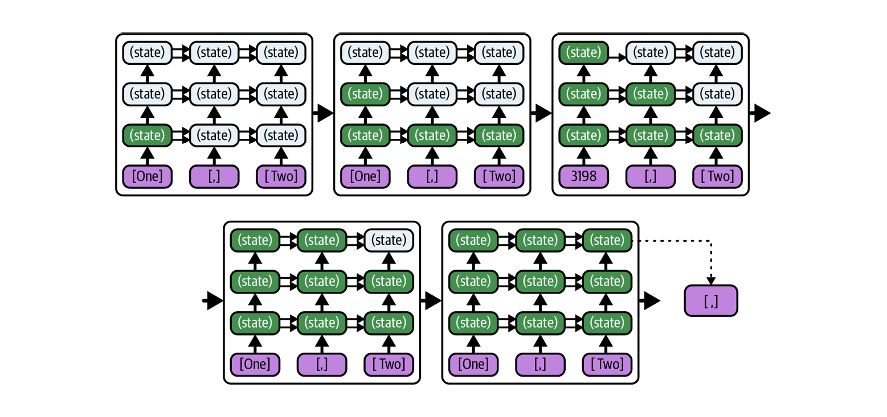
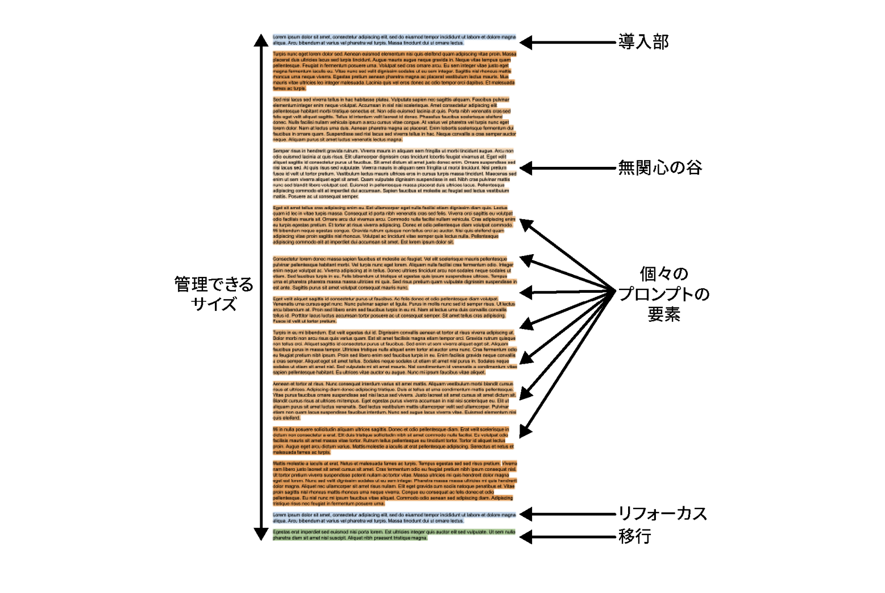

# なぜLLMアプリケーションへの指示は失敗するのか？

## ソフトウェアエンジニアが知るべきLLMの特性

<div class="highlight">
📊 目標：LLMを理解して「これはうまくいきそう感」を得る<br>
🔍 目標：失敗の原因をプロファイルしやすくする
</div>

---

## tl;dr

**全員読もう**

<div class="center-image">


</div>


---

## 今日のアジェンダ

1. **LLMの基本** - 知能はないテキスト補完エンジン
2. **LLMの制約** - なぜ期待通りに動かないのか
3. **LLMアプリケーション** - AIエージェントの仕組み
4. **失敗パターンと対策** - プロンプトエンジニアリング+α

---

# 1. LLMの基本

## 知能はない。考えてもいない。テキストを補完しているだけ。

---

## LLMとは何か？

### 大規模言語モデル（Large Language Model）

- **本質**: 次の単語を予測するタスクを繰り返す **テキスト補完エンジン**
- **学習**: 大量のテキストデータから言語のパターンや構造を学習

<div class="center-image">


</div>

<span class="ref">ref: https://jalammar.github.io/how-gpt3-works-visualizations-animations/
</span>

---

**次の単語に何を選ぶと一番それっぽいでしょう？クイズ**をひたすらに答え続けている
```
["Shohei", "Ohtani", "is", "a"] -> "baseball"? "pitcher"? "great"?

↓ "baseball"

["Shohei", "Ohtani", "is", "a", "baseball"] -> "player"? "pitcher"? "star"?

↓ "player"

["Shohei", "Ohtani", "is", "a", "baseball", "player"] -> "who"? "that"? "from"?
```


---

### 実際には「次のトークン」を予測している
- **例**
"strange new worlds" -> [str][ange][ new][ worlds]
特に単語というわけではない。

- **大文字・小文字で全く扱いが変わる**
"STRANGE NEW WORLDS" -> [STR][ANGE][ NEW][ WOR][L][DS]


---

## Q: 補完エンジンにすぎないLLMはなぜ「Chat」できるのか？

---


### LLMはなぜ「Chat」できるのか？

A.対話データを学習しているから

```yaml
# 学習データに含まれる対話形式の例 (これはちょっと古いらしい)

system: "あなたは親切なプログラミングアシスタントです"
user: "Pythonでリストをソートする方法は？"
assistant: "Pythonでリストをソートする方法をいくつか紹介します..."
user: "逆順にソートするには？"
assistant: "逆順にソートするには..."
```

<div class="engineer-focus">
💻 LLMは「アシスタントらしい応答」を学習しているだけ<br>
実際に理解しているわけではなく、パターンを模倣している
</div>


---

### LLMの応用性の高さ

LLMの基礎は「テキスト補完エンジン」だが、
学習データの中身によって対話・質問応答・コード生成など多様なタスクに対応可能

<div class="engineer-focus">
✅ 自然言語の持つ柔軟性と自由度によって Tool呼び出し・タスク実行型AI Agentが実現
</div>

### 例

```
# タスク実行のための学習データのイメージ

system: "あなたは優秀なプログラミングアシスタントです"
user: "差分をCommitしてPushして"
assistant: "<call git commit> <call git push>"
```
→ LLMの応答で、<code><call git commit></code> の部分が来たらそれをtool呼び出しとして実行する

---

# 2. LLMの制約

## なぜ期待通りに動かないのか？

---

## 制約1: 自己回帰モデル

### 一方向性：未来を見ることができない

**LLMは「左から右へ」の一方向処理のみ可能**

- **後方参照のみ**: 過去のトークンしか参照できない
- **未来予測不可**: 後続の内容を事前に知ることはできない
- **層間制約**: 上位層の情報を下位層に戻せない

<div class="engineer-focus">
・f(1) |> f(2) |> f(3) |> ... |> f(n)<br>
・各レイヤーは前段の出力のみを入力として受け取るだけ
</div>

**この制約により「読み返し」「見直し」が根本的に不可能**

---

### どういうことか？




<div class="ref">
ref: LLMのプロンプトエンジニアリング
</div>

---

### 制約の具体的な影響

<div class="problem">
❌ <strong>文字数カウント</strong>: "strawberryに含まれるRの数は？"<br>
→ すでに処理済みの文字列を「遡って」解析できない
</div>

<div class="problem">
❌ <strong>文字列逆転</strong>: "hello を逆順にして"<br>
→ トークン化＋一方向性により困難
</div>


<div class="problem">
❌ <strong>立ち止まれない</strong>: "このAPIの仕様は..." → 誤った情報を出力開始<br>
→ 途中で間違いに気づいても修正せず継続<br>
→ 一貫して間違った結論に到達
</div>

<div class="solution">
✅ <strong>前向き処理</strong>: "これから書く文章の文字数を数えながら書いて"<br>
→ 生成しながら同時にカウント可能（ただし精度は低い）
</div>

---

## 制約2: トークンベースの処理 に起因する認識の限界

### トークン化による文字レベル情報の損失

```python
# トークン化の例（GPT系モデル）
"ghost"     → ["ghost"]           # 1トークン
"gohst"     → ["g", "oh", "st"]   # 3トークン（別物として認識）
"GitHub"    → ["Git", "Hub"]      # 2トークン
"github"    → ["github"]          # 1トークン（大小文字で異なる）
```

#### 一方向処理との組み合わせ効果

<div class="problem">
❌ <strong>誤字検出の困難さ</strong><br>
・"gohst"を見たとき、一方向処理により"ghost"との関連性を認識しにくい<br>
・どんなトークンも文脈から推測するしかない
</div>

<div class="engineer-focus">
💻 <strong>実用的影響</strong><br>
・変数名の typo、API名の微細な違い、ファイルパスの大小文字違いなどを正確に扱えない
</div>

---

### トークン化の実用的な問題(具体例)

<div class="problem">
❌ <strong>厳密な文字列処理</strong><br>
・正規表現パターンの生成・検証<br>
・ASCIIアート、図表の生成<br>
・コードの行数指定<br>
・変数名のスペルチェック
</div>

<div class="solution">
✅ <strong>トークンレベルで処理しやすいタスク</strong><br>
・自然言語の生成・要約<br>
・意味的類似性の判断<br>
・構造化されたコード生成<br>
・API仕様の理解・説明
</div>

---

## 制約3: 情報順序への依存性

### 「Lost in the Middle」現象

<div class="problem">
❌ <strong>プロンプト順序の影響</strong><br>
・冒頭と末尾の情報は記憶されやすい<br>
・中間部分の情報は活用されにくい<br>
・指示の位置により出力品質が大きく変動
</div>

*コンテキストが大きい場合その問題は顕著。*
<div class="solution">
✅ <strong>対策</strong><br>
・重要な情報は冒頭・末尾に配置<br>
・「本題の質問」をリマインドする。「リフォーカス」
</div>

---


<div class="center-image">


</div>

<div class="ref">
ref: LLMのプロンプトエンジニアリング
</div>

---


## 制約4: 思考時間の欠如

### LLMは「独り言」ができない

<div class="problem">
❌ <strong>即時応答の制約</strong><br>
・「考える時間」が存在しない<br>
・複雑な推論の段階的構築が困難
</div>

<div class="solution">
✅ <strong>Chain of Thought (CoT) による対策</strong><br>
・思考プロセスの外部化を強制<br>
・「ステップバイステップで考えて」指示<br>
・中間推論の明示的出力により品質向上
</div>

<div class="engineer-focus">
💻 LLMに「考えさせる」には思考を出力として表現させる（書かせる）必要がある
</div>

---

## 制約5: ハルシネーションと真実バイアス

### ハルシネーション

<div class="problem">
❌ <strong>「トレーニングデータを模倣するマシン」の残念な副作用</strong><br>
・もっともらしい情報をモデルが「自信を持って」生成してしまう<br>
→「勝手に作り話をしないで」といったプロンプト指示はほとんど効果がない
</div>

<div class="solution">
✅ <strong>対策</strong><br>
・モデルに検証可能な背景情報を提供させる<br>
→ ユーザーが検証する
</div>

<div class="engineer-focus">
裏を返せば、仮説的な状況や反事実的なシナリオを語らせるのは容易。<br>
「2031年、最初のネアンデルタール人が復活してから1年が経過しました」...
</div>

---

## 制約5: ハルシネーションと真実バイアス

### 真実バイアス

<div class="problem">
❌ <strong>プロンプトの情報を「正しい」と過信</strong><br>
・間違ったプロンプトによってハルシネーションが誘発される<br>
・それを途中で訂正するケースはごくまれ
</div>

<div class="engineer-focus">
💻 <strong>実用的影響</strong><br>
・良かれと思って与えた情報が、モデルの誤った推論を誘発する可能性がある<br>
・間違ったファイルを開きながらPrompt指示を行って、意図しないコンテキストを提供してしまう
</div>


---

### チェーホフの銃の誤謬(ごびゅう)

**与えられたのなら、意味があるはずだ**

> 意味のある文章のスニペット（断片）を取得できれば、それは素晴らしいコンテキストとなりますが、無関係な情報を取得してしまうと、他のより有用なコンテキストが埋もれてしまう可能性があります。
~中略~
最悪の場合、モデルは**与えられた情報を必ず活用しようとする傾向がある**ため、完全に無関係なコンテキストまでも深読みしてしまうかもしれません。私たちはこれを「**チェーホフの銃の誤謬**」と呼んでいます。劇作家のアントン・チェーホフは不要な要素を排除することを提唱しており、「第一幕で壁に銃を掛けるのであれば、次の幕でそれを撃たなければならない。もしそうでないのなら、最初からそこに掛けるべきではない」と述べています。

<div class="ref">
ref:LLMのプロンプトエンジニアリング
</div>

---

### 改めて：人間の思考とLLMの処理の違い

人間の言葉は現実を反映するが、モデルの言葉は人間（から生まれた学習データ）を反映する
モデルに渡す言葉とその応答に対するメンタルモデルは、人間のものと異なることを認識する


<div class="ref">
ref: LLMのプロンプトエンジニアリング
</div>

---

# 3. LLMアプリケーション

## AIエージェントの仕組み

---

<div class="center-block">

**「xxを実装してください」って言ったらやってくれた！すごい！魔法！**
**もうエンジニアいらない！**
</div>

---

<div class="center-block">

Claude Code
Github Copilot Agent
Junie
Devin
etc...

なんかすごい

</div>

---
<!-- TODO:LLMは結局文字列しか受け取らず文字列しか生成しないということを強調する。そのため、Context収集やプロンプト生成を行うアプリケーション層の性能と、その特性を知ることもかなり重要。という旨を強調する。 -->

## 「魔法」の正体

<div class="highlight">

**実際は「コンテキスト収集 + プロンプト生成 + LLM呼び出し」の組み合わせと制御**

</div>


これらは「知能」を持つわけではない。
エンジニアのスキルっぽい文章を大量学習したLLM + エンジニアが実装したアプリケーションと制御フロー で実現されている


```
アプリケーションは、コンテキストを収集し、良い断片を選び、プロンプトを生成し、LLMに送信する
↓
LLMはそのプロンプトに基づいて応答を生成
↓
アプリケーションがその応答を解釈して次の実行...(以下ループ)
```
<div class="engineer-focus">
今回の発表では、このコンテキスト収集 → LLM呼び出しの部分を<br>
「<strong>LLMアプリケーション</strong>」と呼ぶことにします
</div>

---

## LLMアプリケーションの実態

<div class="highlight">
LLMは、テキストを受け取ってテキストを生成するだけの「テキスト補完エンジン」<br>
そのため、どの情報も必ず一つのテキストとして渡され、返答もまたテキストとして返される
</div>

<small>LLMアプリケーション層において、どのような情報を収集し、どのようにプロンプトを生成するかが、モデル性能と同等かそれ以上に重要になる</small>

---

## Copilot Agentの内部処理（推測）

```python
def copilot_agent(user_request, workspace):
    context = {
        "current_file": get_active_file(),
        "related_files": find_related_files(),
        "git_history": get_recent_commits(),
        "project_structure": analyze_workspace(),
        "dependencies": parse_package_files(),
        "user_intent": classify_request(user_request)
    }

    prompt = build_structured_prompt(context, user_request)
    response = llm.generate(prompt)
    return response
```

---

## LLMアプリケーション利用の成功要因（1/2）

### 1. アプリケーションの「コンテキスト収集品質」を理解する

<div class="engineer-focus">
💻 **Copilot の例**<br>
・現在のファイル内容の取得精度<br>
・関連ファイルの発見アルゴリズム<br>
・プロジェクト構造の解析能力<br>
・Git履歴からの文脈推測
</div>

**利用者としてできること**:
- 関連ファイルを適切に配置・命名
- プロジェクト構造を標準的な形に整理
- コメントによる文脈情報の提供

---

## LLMアプリケーション利用の成功要因（2/2）

### 2. アプリケーションの「プロンプト構築方式」に合わせる

**構造化された情報提示を意識**:
- 明確なタスク記述
- 具体的な制約条件
- 期待する出力形式の指定

### 3. LLMの制約を理解した期待値設定

<div class="engineer-focus">
💻 **重要な認識**<br>
・アプリケーションの「理解」も統計的推測にすぎない<br>
・100%の精度は期待できない<br>
・最終的な検証・テストは人間が実施<br>
・段階的なタスク実行が効果的
</div>

---

## LLMアプリケーション利用時の典型的問題（1/2）

### 1. コンテキスト汚染の回避

<div class="problem">
❌ **無関係ファイルの影響**<br>
Copilot が古い実装ファイルや無関係なテストファイルを参照<br>
→ チェーホフの銃の誤謬により誤った提案
</div>

<div class="solution">
✅ **対策**<br>
・`.gitignore` での不要ファイル除外<br>
・古いコードファイルの適切な整理<br>
・明確なディレクトリ構造の維持
</div>

---

## LLMアプリケーション利用時の典型的問題（2/2）

### 2. 指示の具体性不足

<div class="problem">
❌ **曖昧な指示による誤解**<br>
"このバグを修正して" → アプリが想定と異なる修正を実行
</div>

<div class="solution">
✅ **改善例**<br>
"TypeError: 'str' object is not callable エラーを修正。line 23のparse_date()呼び出しが問題。str型変数がメソッドと同名になっている"
</div>

### 3. 過度な期待と依存

<div class="problem">
❌ **「AIが全て解決してくれる」という幻想**<br>
LLMアプリケーションに複雑なタスクを丸投げ
</div>

<div class="solution">
✅ **適切な活用**<br>
・小さなタスクに分解して段階的に実行<br>
・生成結果の検証を怠らない<br>
・人間の判断と組み合わせる
</div>

---


# 3. 失敗パターン

## エンジニアがハマりがちな罠

---

## 失敗パターン1: 曖昧なタスク定義

<div class="problem">
❌ 悪い例："このコードをリファクタリングして"<br>
❌ 悪い例："APIドキュメントを作成して"<br>
❌ 悪い例："バグを修正して"
</div>

<div class="solution">
✅ 良い例："このPython関数を、読みやすさを重視してリファクタリングしてください。変数名を明確にし、コメントを追加し、型ヒントを付けてください"
</div>

---

## 失敗パターン2: 複数タスクの同時依頼

<div class="problem">
❌ 悪い例：<br>
"このReactコンポーネントを修正して、テストも書いて、TypeScriptに変換して、ドキュメントも更新して"
</div>

<div class="solution">
✅ 良い例：段階的に実行<br>
1. まずReactコンポーネントを修正<br>
2. 修正内容を確認後、TypeScript変換<br>
3. 変換後にテスト作成<br>
4. 最後にドキュメント更新
</div>

---

## 失敗パターン3: 文脈情報の不足

<div class="problem">
❌ 悪い例："このエラーを解決して"<br>
（どのエラー？どの環境？何をしようとしていた？）
</div>

<div class="solution">
✅ 良い例：<br>
"Next.js 13のApp RouterでuseRouter()を使おうとしたところ、'useRouter' is not a function エラーが発生しました。pages/index.jsからapp/page.jsに移行中です。解決方法を教えてください"
</div>

---

# 4. プロンプトエンジニアリング

## 実践的な改善手法

---

## 手法1: 構造化プロンプト

```yaml
## 役割
あなたは経験豊富なPythonエンジニアです

## タスク
以下のコードの性能を改善してください

## 制約条件
- Python 3.9以上を使用
- 外部ライブラリは numpy, pandas のみ使用可
- メモリ使用量を重視

## 入力コード
[コードをここに]

## 期待する出力
- 改善されたコード
- 変更点の説明
- 性能向上の見積もり
```

---


## 手法2: Few-Shot Prompting（例示による学習）
TODO:以下の内容を２枚程度のスライドにいれる。


LLM (大規模言語モデル) は、プロンプト内のパターンを認識し、それに従って出力を生成する能力に長けています。この特性を効果的に活用するプロンプトエンジニアリングの主要な手法の一つに、**Few-shotプロンプティング**があります。

### Few-shotプロンプティングとは

Few-shotプロンプティングとは、LLMに与えるプロンプトの中に、**期待する出力の形式やスタイルを示す具体的な例（サンプル）をいくつか含める**手法です。これにより、モデルは単に質問を解釈する方法だけでなく、生成すべき補完の具体的な形式まで明確に理解し、模倣することができます。

この手法は、RLHF（人間のフィードバックによる強化学習）によって、より丁寧で有用なレスポンスをするようにトレーニングされたLLMに対して特に効果を発揮します。現代のLLMは、わずか数例（"a few shots"）からでも有用なパターンを抽出し、類似のタスクを実行できることが示されています。

一方で、例をまったく与えず、明示的な指示のみで構成されるプロンプトは**Zero-shotプロンプト**と呼ばれます。Few-shotプロンプトとZero-shotプロンプトの構造の違いは、ソースの図5-2で示されています。

### Few-shotプロンプティングの利点

*   **期待する形式・スタイルを明確に伝えられる**: LLMはパターンを踏襲する傾向が強いため、Q&Aのやり取りに特定のルールや形式がある場合、明示的な指示よりも具体例として示した方が効果的です。これにより、回答の微妙なニュアンスまでコントロールできます。例えば、書評の評価スタイル（辛口か寛容か）をサンプルを通じて指定し、モデルに一貫したキャラクター性を持たせることが可能です。
*   **指示の簡素化**: 質の高い例をいくつか用意できる場合、詳細なルールを文章で長々と列挙するよりも、Few-shotプロンプティングで例示する方が単純で扱いやすいことが多いです。これは、多くのルールが「見ればわかる」という性質を持つためです。
*   **モデルの理解を促進**: モデルにとってタスクの実行方法が明確でない場合に、具体的な参考例を示すことで非常に有効です。

### Few-shotプロンプティングの欠点と実例

Few-shotプロンプティングは強力な手法ですが、以下の3つの重要な欠点があります。

1.  **コンテキストが増えるほど扱いづらくなる**:
    *   問題解決に大量のコンテキスト情報を必要とする場合、例示が増えることでプロンプトが長くなり、LLMの「アテンション機構」が機能しにくくなる可能性があります。モデルが多様なソースから情報を得る際に、例示された情報と主要なタスクのバランスを取るのが難しくなります。
    *   過度に単純化された例を用いると、豊富なコンテキストによって可能となるはずの深い推論や繊細な判断をモデルが適切に行えなくなるリスクがあります。

2.  **例示された情報に偏る（アンカリング）**:
    *   LLMは、最初に与えられた不完全な情報（「ほんの一例」）に引きずられ、それが「普通」だと誤解し、その先入観がその後の判断に過度な影響を与えることがあります。これは「アンカリング」と呼ばれる認知バイアスに似ています。
    *   **実例**: ソースの図5-4では、女の子の赤ちゃんの名前が「最も人気があった年」を予測する例が示されています。プロンプトで「20世紀初頭」の年を例示すると、モデルもその範囲で予測しますが、「21世紀初頭」の年を例示すると、それに合わせて予測結果が大きく変化します。
    *   例示は、対象となるデータの確率分布の特性をモデルに伝達し、最終的な補完結果に影響を及ぼします。そのため、実際のデータ分布から大きく逸脱するような例示は避けるべきです。

3.  **誤ったパターンを示唆する可能性がある**:
    *   与えられた例の中に意図しないパターンが含まれていると、LLMがそれを拾い上げて、望ましくない形で反映してしまうことがあります。
    *   **実例**: ソースの図5-6では、女の子の赤ちゃんの名前とその人気があった年を提示する際に、年が「昇順」に並んでいるか「降順」に並んでいるかによって、モデルが次に生成する予測結果が異なることが示されています。プロンプトの例は決してランダムな順序にはならないため、意図せずパターンが生まれてしまう可能性が高まります。
    *   また、「良いケース（正常系）を先に、悪いケース（異常系）を後に」という一般的な順序付けパターンも、モデルに不当に悲観的な判断をさせる可能性があります。ソースの図5-7では、この順序付けがモデルの回答に与える影響が示されています。

### Few-shotプロンプティングの効果的な活用法

これらの欠点があるにもかかわらず、Few-shotプロンプティングは有用なツールです。
*   **コンテキスト増大への対処**: 出力形式など特定の側面のみを説明する場合は、小規模な例でも十分その意図を伝えることが可能です。
*   **アンカリングへの対処**: 極端に狭い期待値を伝えないよう、適切な範囲の例を提供するべきです。また、実際の過去の事例にアクセスできる場合は、それらの中から代表的なサンプルを抽出してFew-shotプロンプトに組み込むことで、より現実的な分布を実現できます。
*   **誤ったパターンへの対処**: 収集した例の中から一部を抽出してランダムに並び替え、最終結果への影響を評価する手法があります。近年では、DSPyのような「プロンプト最適化」ツールも登場しており、Few-shotの例を体系的に選択・並び替えを行い、精度などの評価指標を最適化する方法を提供しています。
*   **使用の判断**: モデルにとってタスクの実行方法が明確でない場合に非常に有効ですが、モデルがすでにタスクを理解できていると思われる場合は、プロンプトが冗長になるだけでなく、上記のような問題が発生するリスクも高まるため、使用する必要はありません。

---

## 手法3: Chain of Thought (CoT)

**思考プロセスを段階的に外部化させる手法**

LLMには「考える時間」がないため、思考プロセスを出力として表現させることで、より深い推論を促す

<div class="engineer-focus">
💻 **CoTの効果**<br>
・複雑な問題を小さなステップに分解<br>
・中間推論の明示により精度向上<br>
・デバッグしやすい思考プロセス
</div>

```yaml
## タスク
以下のアルゴリズムの時間計算量を分析してください

## 分析手順
1. まず、アルゴリズムの各ステップを特定する
2. 各ステップの実行回数を計算する
3. 最も時間のかかる操作を特定する
4. 全体の時間計算量を導出する
5. 改善可能な点があれば提案する

各ステップで思考プロセスを明示してください。

[コードをここに]
```

---


---

# まとめ

## 成功するLLM活用のポイント

---

## 成功するLLM活用のポイント

### 🧠 **1. LLMは統計的予測エンジン**
**なぜ**: 自己回帰モデル＋トークン化により、文字レベルの厳密処理が苦手
**対策**: 正規表現や厳密な文字列処理は別ツールと組み合わせる

### 🎯 **2. 具体的で構造化された指示**
**なぜ**: 後戻りできない特性により、曖昧な指示では間違った方向に進む
**対策**: 役割・タスク・制約・期待する出力を明確に構造化

### 📝 **3. 段階的なタスク分解**
**なぜ**: 思考時間の欠如により、複雑なタスクを一度に処理できない
**対策**: CoT（思考の連鎖）を活用し、小さなステップに分解

### 🔍 **4. コンテキストの質を重視**
**なぜ**: チェーホフの銃の誤謬により、無関係な情報も重要と解釈する
**対策**: 関連性のある情報のみを厳選し、ノイズを排除

### 🛠 **5. LLMアプリケーションは単なるツール**
**なぜ**: 「知能」はなく、パターン認識による統計的推測にすぎない
**対策**: 過度な期待を避け、検証・テストは人間が責任を持つ
